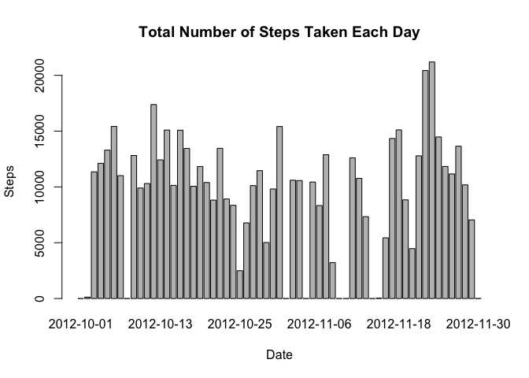
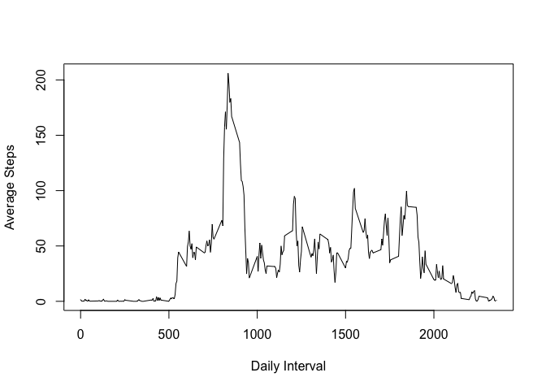
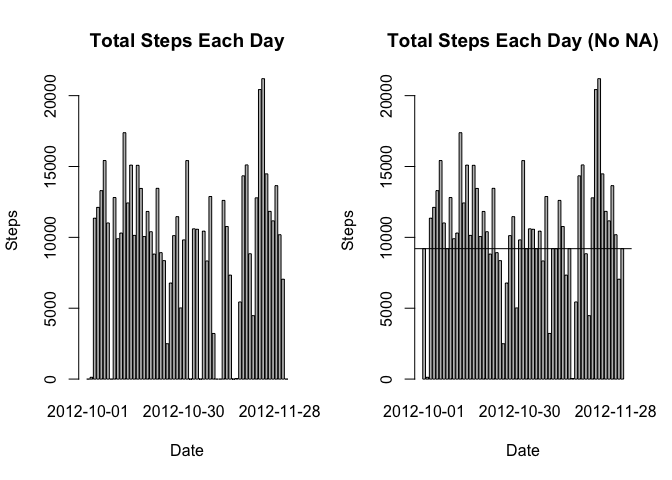
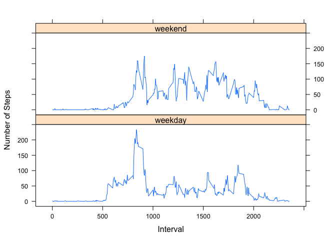

# Reproducible Research: Peer Assessment 1


## Loading and preprocessing the data

1. Load the data (i.e. read.csv())

```r
library(dplyr)
```

```
## 
## Attaching package: 'dplyr'
## 
## The following objects are masked from 'package:stats':
## 
##     filter, lag
## 
## The following objects are masked from 'package:base':
## 
##     intersect, setdiff, setequal, union
```

```r
library(lattice)

if(!exists("./activity.zip")){
    fileUrl <- "https://d396qusza40orc.cloudfront.net/repdata%2Fdata%2Factivity.zip"
    download.file(fileUrl, destfile = "activity.zip", method = "curl")
}

activityUnzip <- unzip(("activity.zip"), files = "activity.csv")

activityData <- read.csv(activityUnzip, sep = ",", header = TRUE)
```

2. Process/transform the data (if necessary) into a format suitable for your analysis


```r
activityData$date <- as.Date(activityData$date, "%Y-%m-%d")
```

## What is mean total number of steps taken per day?

1. Calculate the total number of steps taken per day


```r
activityDataDailySteps <- activityData%>%
    group_by(date)%>%
    summarise(steps = sum(steps, na.rm = TRUE))
```

2. Make a histogram of the total number of steps taken each day


```r
barplot(activityDataDailySteps$steps,
        names.arg = activityDataDailySteps$date,
        xlab = "Date",
        ylab = "Steps",
        main = "Total Number of Steps Taken Each Day")
```

 

3. Calculate and report the mean and median of the total number of steps taken per day


```r
activityDataDailyMean <- activityData%>%
    group_by(date)%>%
    summarise(mean = mean(steps, na.rm = TRUE))

activityDataDailySteps <- cbind(activityDataDailySteps,
                                mean = round(activityDataDailyMean$mean,
                                             digits = 2))

activityDataDailyMedian <- activityData%>%
    group_by(date)%>%
    summarise(median = median(steps, na.rm = TRUE))

activityDataDailySteps <- cbind(activityDataDailySteps,
                                median = activityDataDailyMedian$median)

activityDataDailySteps
```

```
##          date steps  mean median
## 1  2012-10-01     0   NaN     NA
## 2  2012-10-02   126  0.44      0
## 3  2012-10-03 11352 39.42      0
## 4  2012-10-04 12116 42.07      0
## 5  2012-10-05 13294 46.16      0
## 6  2012-10-06 15420 53.54      0
## 7  2012-10-07 11015 38.25      0
## 8  2012-10-08     0   NaN     NA
## 9  2012-10-09 12811 44.48      0
## 10 2012-10-10  9900 34.38      0
## 11 2012-10-11 10304 35.78      0
## 12 2012-10-12 17382 60.35      0
## 13 2012-10-13 12426 43.15      0
## 14 2012-10-14 15098 52.42      0
## 15 2012-10-15 10139 35.20      0
## 16 2012-10-16 15084 52.38      0
## 17 2012-10-17 13452 46.71      0
## 18 2012-10-18 10056 34.92      0
## 19 2012-10-19 11829 41.07      0
## 20 2012-10-20 10395 36.09      0
## 21 2012-10-21  8821 30.63      0
## 22 2012-10-22 13460 46.74      0
## 23 2012-10-23  8918 30.97      0
## 24 2012-10-24  8355 29.01      0
## 25 2012-10-25  2492  8.65      0
## 26 2012-10-26  6778 23.53      0
## 27 2012-10-27 10119 35.14      0
## 28 2012-10-28 11458 39.78      0
## 29 2012-10-29  5018 17.42      0
## 30 2012-10-30  9819 34.09      0
## 31 2012-10-31 15414 53.52      0
## 32 2012-11-01     0   NaN     NA
## 33 2012-11-02 10600 36.81      0
## 34 2012-11-03 10571 36.70      0
## 35 2012-11-04     0   NaN     NA
## 36 2012-11-05 10439 36.25      0
## 37 2012-11-06  8334 28.94      0
## 38 2012-11-07 12883 44.73      0
## 39 2012-11-08  3219 11.18      0
## 40 2012-11-09     0   NaN     NA
## 41 2012-11-10     0   NaN     NA
## 42 2012-11-11 12608 43.78      0
## 43 2012-11-12 10765 37.38      0
## 44 2012-11-13  7336 25.47      0
## 45 2012-11-14     0   NaN     NA
## 46 2012-11-15    41  0.14      0
## 47 2012-11-16  5441 18.89      0
## 48 2012-11-17 14339 49.79      0
## 49 2012-11-18 15110 52.47      0
## 50 2012-11-19  8841 30.70      0
## 51 2012-11-20  4472 15.53      0
## 52 2012-11-21 12787 44.40      0
## 53 2012-11-22 20427 70.93      0
## 54 2012-11-23 21194 73.59      0
## 55 2012-11-24 14478 50.27      0
## 56 2012-11-25 11834 41.09      0
## 57 2012-11-26 11162 38.76      0
## 58 2012-11-27 13646 47.38      0
## 59 2012-11-28 10183 35.36      0
## 60 2012-11-29  7047 24.47      0
## 61 2012-11-30     0   NaN     NA
```

## What is the average daily activity pattern?

1. Make a time series plot (i.e. type = "l") of the 5-minute interval (x-axis) and the average number of steps taken, averaged across all days (y-axis)


```r
activityDataIntervalMean <- activityData%>%
    group_by(interval)%>%
    summarise(mean = mean(steps, na.rm = TRUE))

plot(activityDataIntervalMean$interval,
     activityDataIntervalMean$mean,
     type = "l",
     xlab = "Daily Interval",
     ylab = "Average Steps")
```

 

2. Which 5-minute interval, on average across all the days in the dataset, contains the maximum number of steps?


```r
activityDataMeanMax <- activityDataIntervalMean[which.max(activityDataIntervalMean$mean),]
activityDataMeanMax$interval
```

```
## [1] 835
```

## Imputing missing values

1. Calculate and report the total number of missing values in the dataset (i.e. the total number of rows with NAs)


```r
sum(is.na(activityData))
```

```
## [1] 2304
```

2. Devise a strategy for filling in all of the missing values in the dataset. The strategy does not need to be sophisticated. For example, you could use the mean/median for that day, or the mean for that 5-minute interval, etc.

AND

3. Create a new dataset that is equal to the original dataset but with the missing data filled in.


```r
activityDataIntervalMean$mean[is.na(activityDataDailyMean$mean)] <- 0

activityDataNaIndex <- which(is.na(activityData$steps))

activityDataNoNa <- activityData

for(i in activityDataNaIndex) {
    if(i%%288 == 0){
        activityDataNoNa$steps[i] <- round(activityDataIntervalMean$mean[288],
                                   digits = 0)
    } else {
        activityDataNoNa$steps[i] <- round(activityDataIntervalMean$mean[i%%288],
                                   digits = 0)
    }
}
```

4. Make a histogram of the total number of steps taken each day and Calculate and report the mean and median total number of steps taken per day. Do these values differ from the estimates from the first part of the assignment? What is the impact of imputing missing data on the estimates of the total daily number of steps?


```r
activityDataNoNaSteps <- activityDataNoNa%>%
    group_by(date)%>%
    summarise(steps = sum(steps, na.rm = TRUE))

par(mfrow = c(1,2))

barplot(activityDataDailySteps$steps,
        names.arg = activityDataDailySteps$date,
        xlab = "Date",
        ylab = "Steps",
        main = "Total Steps Each Day")

barplot(activityDataNoNaSteps$steps,
        names.arg = activityDataNoNaSteps$date,
        xlab = "Date",
        ylab = "Steps",
        main = "Total Steps Each Day (No NA)")
abline(h = 9202)
```

 

```r
activityDataNoNaMean <- activityDataNoNa%>%
    group_by(date)%>%
    summarise(mean = mean(steps, na.rm = TRUE))

activityDataNoNaSteps <- cbind(activityDataNoNaSteps,
                                mean = round(activityDataNoNaMean$mean,
                                             digits = 2))

activityDataNoNaMedian <- activityDataNoNa%>%
    group_by(date)%>%
    summarise(median = median(steps, na.rm = TRUE))

activityDataNoNaSteps <- cbind(activityDataNoNaSteps,
                                median = activityDataNoNaMedian$median)
```

It can be seen by replacing the NA values with the daily interval mean values that on any given day where values were missing the median values are equal to 25 steps as opposed to 0. Also, having 8 days that were once never calculated for now have a value of 9202 steps lends to increasing the estimates of the total daily number of steps.

## Are there differences in activity patterns between weekdays and weekends?

1. Create a new factor variable in the dataset with two levels – “weekday” and “weekend” indicating whether a given date is a weekday or weekend day.


```r
activityData <- cbind(activityData,
                      weekday_end = ifelse(weekdays(activityData$date) == "Saturday" | weekdays(activityData$date) == "Sunday", "weekend", "weekday"))
```

2. Make a panel plot containing a time series plot (i.e. type = "l") of the 5-minute interval (x-axis) and the average number of steps taken, averaged across all weekday days or weekend days (y-axis). See the README file in the GitHub repository to see an example of what this plot should look like using simulated data.


```r
activityDataMean <- activityData%>%
    group_by(interval, weekday_end)%>%
    summarise(mean = round(mean(steps, na.rm = TRUE)),
              digits = 0)

xyplot(activityDataMean$mean ~ activityDataMean$interval | activityDataMean$weekday_end,
       layout = c(1, 2),
       type = "l",
       xlab = "Interval",
       ylab = "Number of Steps")
```

 
